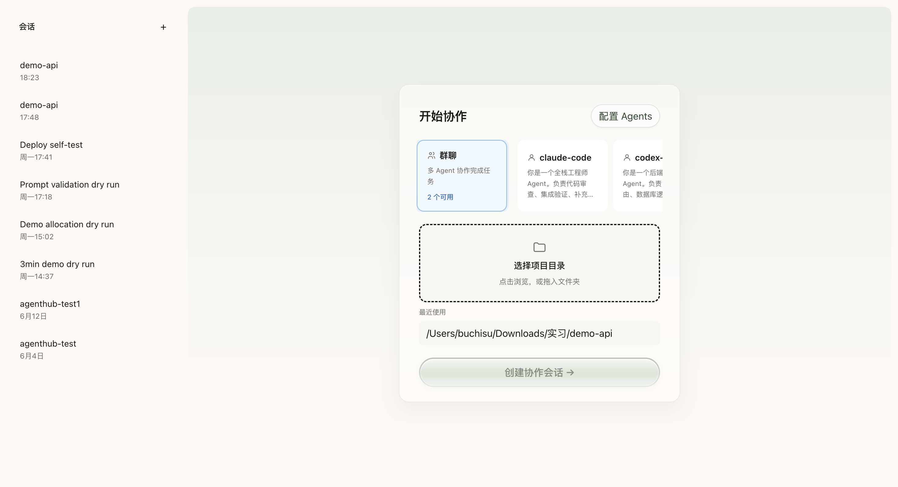
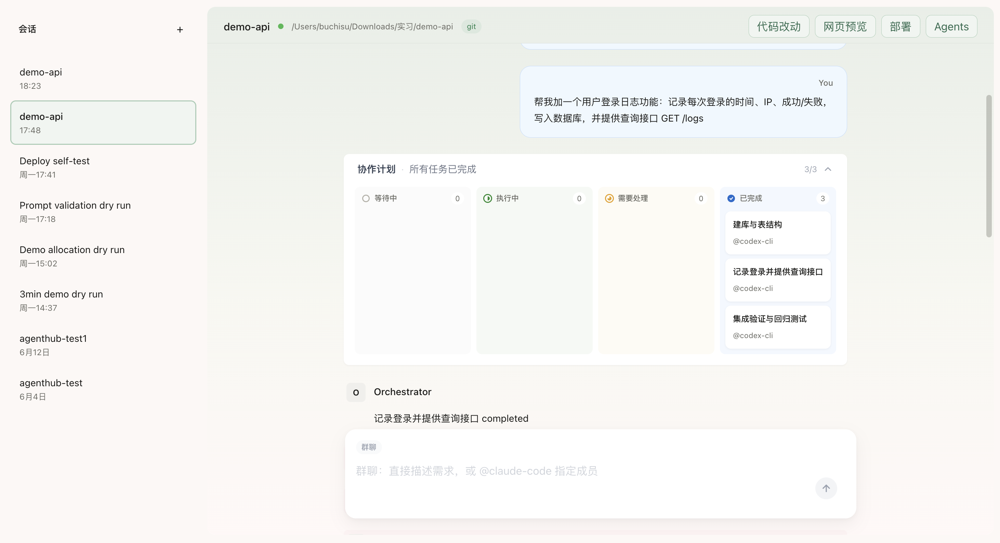

# AgentHub

本地多 Agent 协作平台，统一接入 Claude Code CLI 与 Codex CLI，以 IM 聊天界面驱动多个 AI Agent 并行开发同一代码仓库，实时呈现每个 Agent 的工具调用、文件变更与合并过程。

**技术栈：** TypeScript · React · Vite · Tailwind CSS · Node.js · Express · Socket.IO · SQLite

---

## 界面预览

**Agent 配置与会话创建** — 注册 Claude Code / Codex Agent，绑定本地项目目录，创建协作会话。



**IM 聊天页面与任务协作看板** — 发送一条消息，Orchestrator 自动规划 DAG 任务图，多个 Agent 并行执行，实时展示每个 Agent 的工具调用与输出。



---

## 为什么做这个

Claude Code 和 Codex 能力互补但各自孤立——切换工具意味着丢失上下文、重复工作、手动合并冲突。AgentHub 把它们连接起来：一个对话，多个 Agent，共享同一个工作区。

---

## 核心机制

### Orchestrator → DAG → 并行执行

采用 **Orchestrator-Worker 模式**：Orchestrator 负责规划与调度，Claude Code / Codex 作为 Worker 负责执行。用户发送消息后，Planner Agent（基于 OpenAI function calling）将需求拆解为带依赖关系的任务图。无依赖的任务并行执行，下游任务的 prompt 中自动注入上游任务的输出摘要。

```
用户：「实现登录接口 + 为它写测试」

Orchestrator 规划：
  t1: 实现 JWT 登录接口   → 分配给 Claude Code
  t2: 实现 refresh token → 分配给 Codex          （与 t1 并行）
  t3: 编写认证测试        → 依赖 t1、t2

t3 的 prompt 包含：「上游输出：t1 已完成 /api/auth/login，返回 JWT token...」
```

### git worktree 工作区隔离

每个 Agent run 获得独立的 `git worktree` + 分支，共享 `.git` 对象存储，文件目录完全隔离，Agent 之间不会互相覆盖。

```
.agenthub/worktrees/
  <run-id-1>/   ← Claude Code 在此工作（分支：agenthub/run-abc）
  <run-id-2>/   ← Codex 在此工作      （分支：agenthub/run-def）
```

### 三路对比合并

Run 完成后执行三路对比：

| 版本 | 含义 |
|------|------|
| **base** | Run 启动时的文件内容 |
| **run** | Agent 的产物 |
| **current** | 主目录当前状态（可能已被其他 Agent 修改） |

`current == base` 时自动合入；否则将冲突推给用户裁决，三个版本并排展示。

### 工具调用审批统一到 Web UI

Claude Code 和 Codex 各自在终端弹出危险操作审批，用户无法同时管理多个窗口。AgentHub 通过 `PreToolUse Hook` 拦截所有 Agent 的工具调用，将审批请求重定向到 Web UI，一个界面管理所有 Agent。

### 实时事件流

服务端解析每个 CLI 进程的 `stream-json` 输出，通过 Socket.IO 推送结构化事件，前端实时重建完整执行过程。覆盖 14 种事件类型：`text_delta`、`tool_started`、`tool_completed`、`run_completed`、`approval_required` 等。

---

## 工程细节

**消息队列** — DAG 执行期间收到的新消息存入队列，当前计划完成后自动排空处理，保证顺序不丢失。

**冲突预测** — 规划阶段扫描各任务的 `affected_files` 重叠情况，在 Agent 启动前预标记潜在冲突。

**崩溃恢复** — 每次状态变更都持久化到 SQLite。服务重启后，Orchestrator 从数据库重建执行中的计划，继续处理未完成任务。

**`@slug` 直连路由** — 消息前缀 `@agent-name` 可绕过 Orchestrator 规划，直接路由到指定 Agent。

**Preview / Deploy** — Run 完成后自动检测 `package.json` 脚本，在 worktree 中启动开发服务器，合并前可在浏览器预览变更效果。

---

## 快速启动

```bash
# 安装依赖
cd server && npm install
cd ../frontend && npm install

# 启动后端（终端 1）
cd server && npm run dev

# 启动前端（终端 2）
cd frontend && npm run dev
```

浏览器打开 `http://localhost:5173`，绑定本地项目目录，创建协作会话。

启用 LLM Planner 需在 `server/.env` 中配置：

```
PLANNER_API_URL=https://api.openai.com/v1
PLANNER_API_KEY=sk-...
PLANNER_MODEL=gpt-4o
```

未配置时 Orchestrator 降级为单任务执行。

---

## 项目结构

```
frontend/
  components/
    ChatArea/               主对话视图
    PlanCard/               DAG 可视化 + 任务状态
    ProjectArtifactPanel/   每次 Run 的产物归档
    ToolApprovalCard/       统一工具审批 UI

server/
  modules/
    orchestrator/           Planner Agent + DAG 调度器
    merge/                  三路合并 + 冲突裁决
    workspaces/             git worktree 生命周期管理
    approvals/              PreToolUse Hook → Web UI 桥接
    deploy/ preview/        开发服务器管理
  runtime/
    claude/                 Claude Code CLI 适配器 + 事件解析
    codex/                  Codex CLI 适配器 + 事件解析
    base/                   抽象 AgentRuntime 接口
```

---

## 调研背景

在确定合并方案前，调研了约 20 个开源多 Agent 项目（git-lanes、Weave、Wit、STORM、Maestro-AI、Taskplane 等）及 3 篇学术论文，主要结论：

- git worktree 隔离 + 三路合并是行业主流基线
- LLM 合并不是主流——Weave 的 Tree-sitter 实体级合并可消除 95% 假冲突，零 token 成本
- Token 消耗的大头在编码阶段和上下文重传，不在合并环节
- LLM 在合并流水线中的真正价值是 **CI 失败后的自修复**，而非解决 diff 冲突

`use_llm` 合并策略作为预留接口保留，计划在确定性方案无法解决时配合 token 预算上限激活。